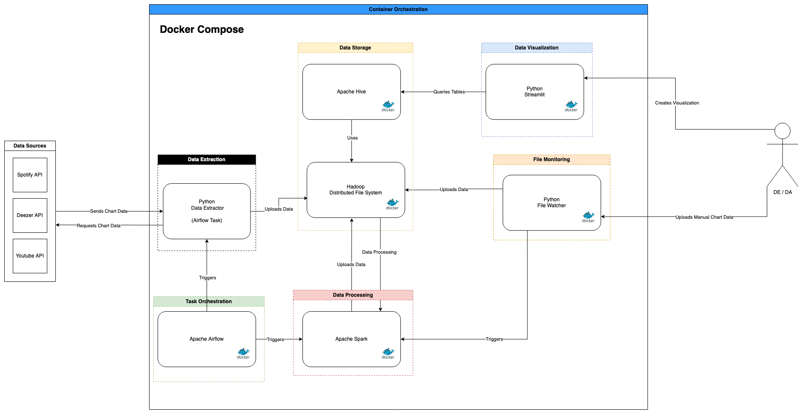
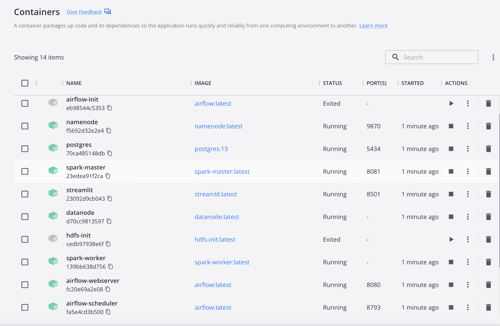
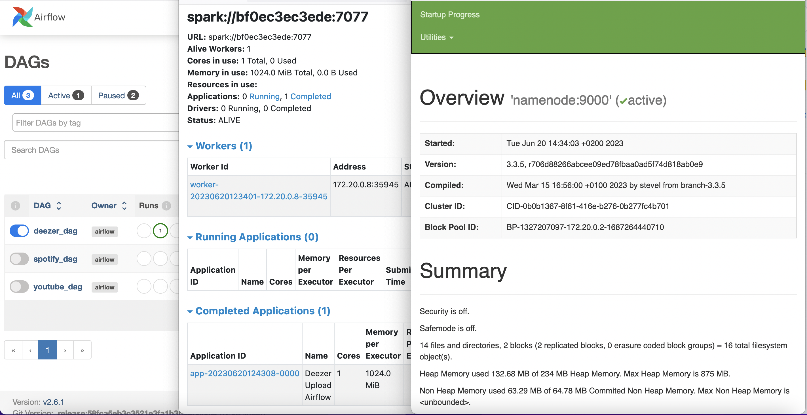
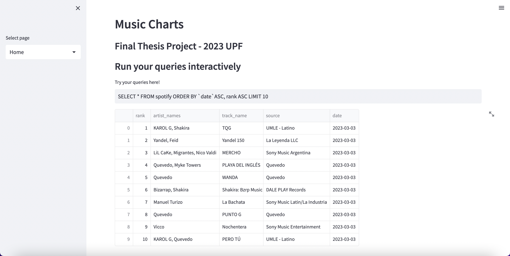
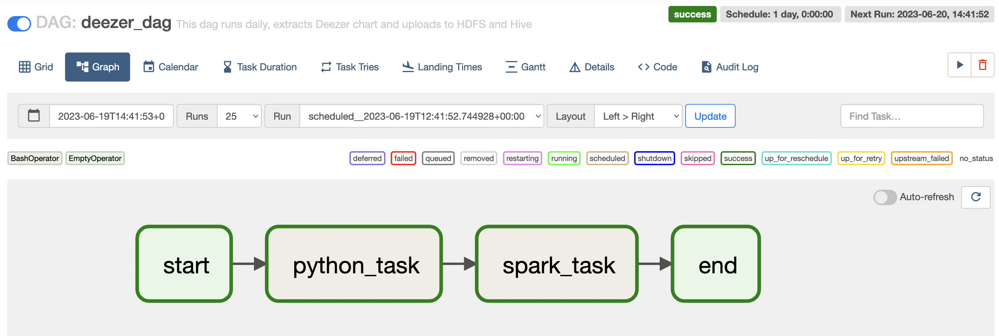

# UPF 2023 - Barcelona
## Final Bacherlor's Degree Project by Brayan Gonzalez

### Title: Design and implementation of a Big Data architecture for data analysis



## Prerequisites
In order to install and execute this project you will need to have installed:
* Docker / Docker Compose
* Git

Additionally, if you want to execute the sample DAG that gets the Spotify API data, you will need to get the API credentials and **paste the credentials inside the Python file airflow/dags/ETL/credentials.py**

* More info: https://developer.spotify.com/documentation/web-api

## Installation
*Note that the commands provided are valid for UNIX OS (MacOS / LInux)*

Open a terminal and execute the following steps to clone the repository:

* ```cd PATH_TO_YOUR_DESIRED_INSTALLATION_DIRECTORY```
* ``git clone https://github.com/iambriangon/UPF-TFG-2023-BigDataArchitecture.git``

Go to the directory where the repository is
* ````cd PATH_TO_THE_REPOSITORY_CLONED````

In order to have all the Docker images prepared you will need to build them

You can either execute manually the commands in ``build-base-images.sh`` or execute the bash script by

* Giving permissions ```chmod +x build-base-images.sh```
* and executing the script ```./build-base-images.sh```

## Running the architecture

**Make sure that your Docker Desktop is running before executing the previous steps in case you are a Windows/MacOS user**

If you are running the application for the first time you will need to execute
* ```docker compose up -d --build``` (MacOS) or
* ``docker-compose up -d --build`` (Linux)

This command, with the flag ``--build``, will build all the necessary images that are necessary.

The next time you run the application you will not have to pass the ``--build`` flag, e.g:
* ```docker compose up -d``` (MacOS) or
* ``docker-compose up -d`` (Linux)



## Accessing the different components

After you have the application up and running, you can access the different user interfaces accessing the following URLs:

* Spark Master UI. http://localhost:8081
* HDFS UI. http://localhost:8081
* Airflow UI. http://localhost:8080. (**user**: airflow, **password**: airflow)
* Hive Server UI. http://localhost:10002



## Sample Workflow

### Data Ingestion
This project has incorporated 2 mechanism to ingest the data:

* Using Airflow to get the data through APIs and perform an ETL process
* Upload a file to a directory and with a File Watcher perform the ETL process

#### Get data from APIs using Airflow
* Go to Airflow UI (http://localhost:8080) and run any dag by toggling the button

#### Upload manual data
* Copy the data from sample_files to watcher/files. e.g ```cp sample_files/* watcher/files```

### Data Visualization
Once the data is uploaded to Hive you can start the Streamlit application


* Open a Terminal
* Enter to the Streamlit container: ```docker exec -it streamlit bash```
* Run: ````streamlit run visualization.py```` to start the application
* Enter Streamlit Application (http://localhost:8501)
* Press CONTROL+C to stop the Streamlit Application
* Enter ``exit`` to exit Streamlit container
* 


NOTE: In addition to ``visualization.py`` there is another file `visualization_2.py` that contains more examples of visualization. 
In order to see the visualization correctly in ```visualization_2.py``` make sure Hive contains all the data in sample_files directory, e.g, perform the 'Upload manual data' steps.


## Stop application
To stop all the containers you will need to run in your terminal (make sure you are in the directory where the docker-compose.yml file is):
* ```docker compose down``` (MacOS) or
* ``docker-compose down`` (Linux)


## Workflow personalization


If you want to ingest your own data and make your own visualizations, you will need to write your own Airflow DAGs, to ingest, process the data based on your own use case. Similarly, you can modify the file ``watcher/pipeline.py`` to personalize the processing steps for the data tha is uploaded manually.

The same applies for the Streamlit application, it has to be adapted for the specific use case